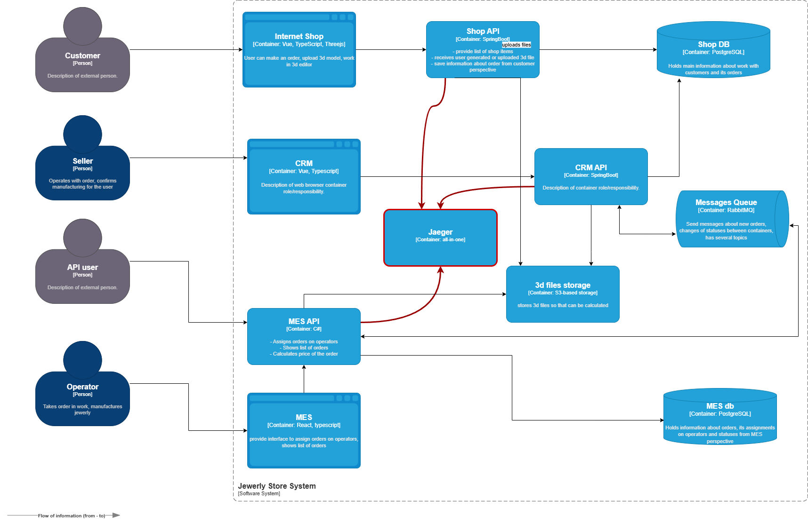

# Трейсинг

## Мотивация

*   улучшение клиентского опыта:
    *   ускорение реакции на жалобы клиентов
    *   уменьшение числа просроченных заказов
    *   снижение финансовых и репутационных потерь
*   выявление узких мест и оптимизация процессов
    *   нахождение узких мест
    *   быстрая жиагностика проблем с синхронизацией между сервисами
    *   оптимизация бизнес-процессов
*   увеличение производительности
    *   прозрачноcть для менеджеров и операторов
    *   информация для масштабирования при росте заказов

## Решение

Реализовать трейсинг заказов для отслеживания пути каждого заказа через системы (онлайн-магазин, CRM, MES) и их статусы (INITIATED → CLOSED).  
В качестве системы сбора и отображения использовать Jaeger (all-in-one).  
Для трейсинга будут использоваться span для каждого статуса заказа с метками order\_id, system.

Порядок действий

*   Развернуть Jaeger (All-in-One или компоненты: Collector, Query, Agent) на EC2 или в Docker-контейнере
*   Добавить библиотеки OpenTelemetry или Jaeger SDK в код приложений (онлайн-магазин: Java Spring Boot, CRM: Java Spring Boot, MES: C#).
*   Создать spans для каждого статуса заказа (например, INITIATED, PRICE\_CALCULATED) с метками (order\_id, system) и временными метками.
*   Настроить передачу данных трейсинга в RabbitMQ, для сохранения контекста между системами.
*   Настроить приложения для отправки трейсов в Jaeger Collector через OpenTelemetry по HTTP.
*   Настроить Jaeger UI для визуализации трейсов по order\_id, фильтрации по системам и статусам.

[./jewerly\_c4\_model.drawio.png](./jewerly_c4_model.drawio.png)

### Компромиссы

Невозможно отследить прохождение заказа внутри очереди, внутри СУБД.

### Безопасность

Доступ к системе только из внутренней сети.  
Административный доступ предоставить девопсам и сетевым администраторм, доступ к дашбордам предоставить операторам и менеджерам.