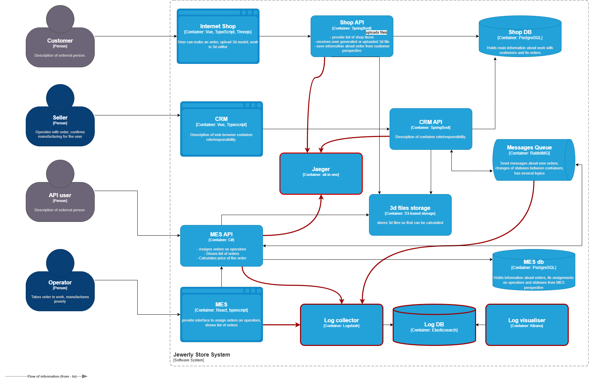

# Логирование

> Сразу скажу, я ни разу не настраивал ни логирование веб-приложений, ни логирование с использованием ELK, поэтому для меня не до конца понятно как его организовать не с точки зрения развертывания, а с точки зрения логируемых систем и их событий. Из теории в этом курсе я больше понимать не стал, к сожалению.  
> Поэтому в решении только то, что я понял.

## Мотивация

Логирование необходимо для диагностики узких мест, повышения прозрачности процессов и устранения ошибок.

Что логировать в первую очередь:

*   **MES** — источник основных проблем: медленный дашборд, долгий расчёт стоимости напрямую влияют на операторов и клиентов.  
    Кроме того, через него идет основной поток заказов. 
*   **RabbitMQ** — критическая интеграция: Сбои в очередях могут быть причиной несогласованности данных и просрочек и пропажи заказов.

## Решение

Реализовать логирование на стеке ELK:

*   Свой индекс для каждой системы
*   ежедневная ротация
*   ILM: Hot (активное использование, 7 дней), Warm (хранение, 30 дней), Delete (удаление после 90 дней).

Что сделать:

*   **Развёртывание ELK Stack**  
    Установить Elasticsearch, Logstash и Kibana на EC2-инстансах или в Docker-контейнерах
*   **Конфигурация Elasticsearch**  
    Настроить Elasticsearch для индексации логов с отдельными индексами для MES
*   **Инструментирование MES**  
    Добавить библиотеку логирования в бэкенд MES и и библиотеку для React фронтенда, настроить вывод логов
*   **Логирование RabbitMQ**  
    Включить встроенное логирование RabbitMQ и настроить экспорт логов через плагин

[./jewerly\_c4\_model.drawio.png](./jewerly_c4_model.drawio.png)