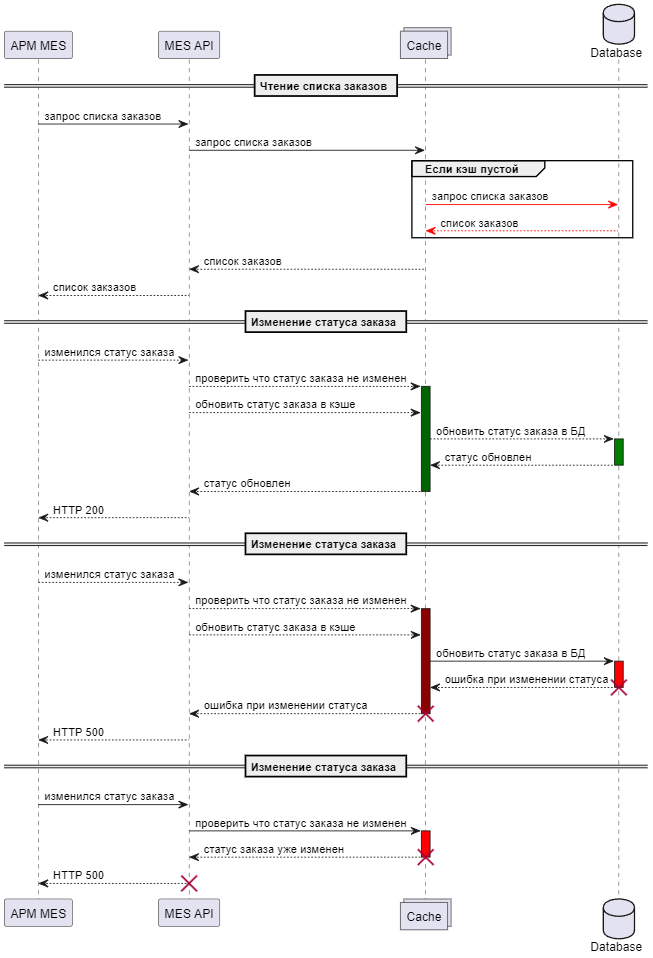

# Кэширование

## Мотивация

*   Повышение производительности благодаря ускорению работы операторов
*   Снижение нагрузки на бэкенд позволит обеспечить стабильность при росте заказов и позволит избежать масштабирования ресурсов.
*   Более быстрая обработка заказов

## Решение

Применить кэширование на сервере, т.к. имеем дело с динамически меняющейся информацией.  
Кэш будет использоваться только для работы дашборда операторов.  
Он будет располагаться между API MES и СУБД и будет использовать комбинацию Refresh-Ahead, Write-Through.  
В кэше будет содержаться список всех незакрытых заказов, таким образом, размер кэша всегда будет меньше таблицы всех заказов в основном хренилище.  
Refresh Ahead — кэш будет заполняться актуальными данными при старте системы с программной инвалидацией по событиям:

*   пришел новый заказ из CRM или от клиентов B2B
*   заказ перешел в статус `CLOSED`

Write-Trough изменения заказов в дашборде операторами будет проходить через кэш.

В отличие от других паттернов кэширования это позволит максимально снизить нагрузку на СУБД, данные в кэше всегда будут консистенты.

[./seq.png](./seq.png)